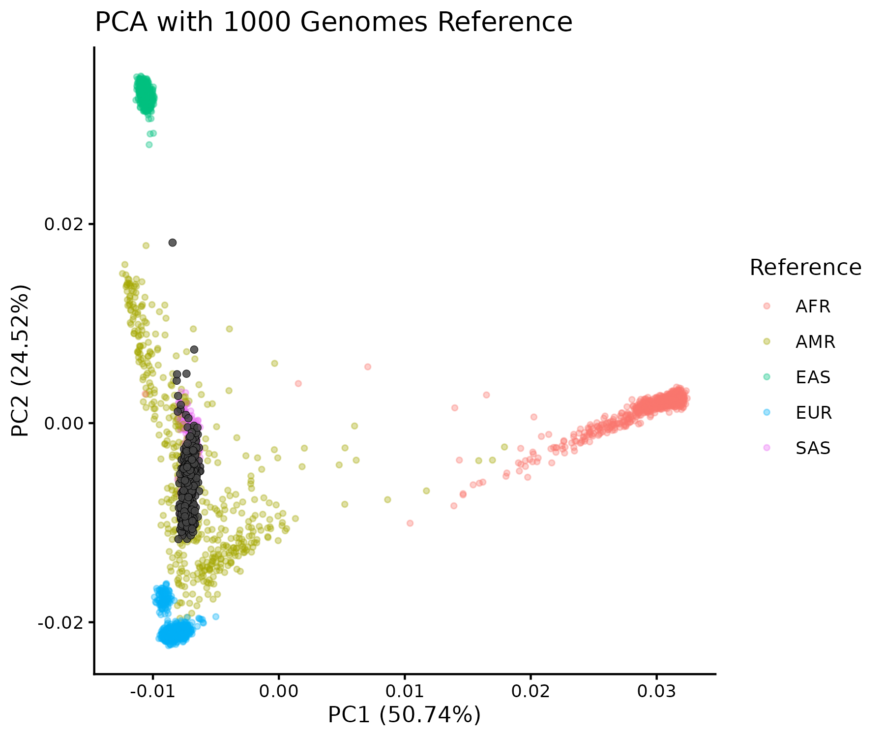

# Ancestry Inference via PCA (1000 Genomes + Study Cohort)

This repository provides a reproducible implementation of the ancestry principal component analysis (PCA) workflow of data used in our COVID-19 GWAS.

**Goal of this analysis is**
- Place study samples within a global ancestry framework
- Identify population outliers

---

## Study Context

India remains underrepresented in large-scale genomic studies. Our work investigates whether population-specific genetic variation contributes to COVID-19 severity and evaluates how reference panel choice influences GWAS resolution.

**Kaushik, Mohite et al., 2026**
***PLOS Neglected Tropical Diseases***
https://doi.org/10.1371/journal.pntd.0014020

---

## Data Availability

- Study dataset: https://doi.org/10.6084/m9.figshare.29650937
- 1000 Genomes reference (PLINK format):
  https://www.cog-genomics.org/plink/2.0/resources

---

## PCA Strategy

PCA is performed jointly on the merged dataset of study samples and 1000 Genomes reference individuals.

- Global ancestry inference
- Detection of population outliers
- Generation of covariates for association models

Projection-based PCA is not implemented but can be incorporated if required.

---

## PCA Interpretation

**Study samples (indian)** cluster predominantly within the **South Asian (SAS)** super-population.

<h2>PCA Plot</h2>

<p>PCA plot (PC1 vs PC2):</p>




- PC1 (~50%) separates African vs non-African populations
- PC2 (~24%) captures Eurasian structure

A minor shift toward European clusters is observed, consistent with known admixture patterns in South Asian populations. No discrete outliers are evident.

---

## Variance Explained

The scree plot shows a strong elbow at PC3, with >80% variance explained by the first three components, indicating that population structure is largely captured by the leading PCs.

<p>Scree plot:</p>


---

## Pipeline Overview

1000 Genomes + Study data    
↓    
Variant filtering (biallelic SNPs A/C/G/T only)    
↓    
Removal of strand-ambiguous SNPs (A/T, C/G)    
↓    
Duplicate variant removal    
↓    
Autosomal filtering (chr 1–22)    
↓    
SNP intersection (rsID-based)    
↓    
Dataset merging    
↓    
LD pruning    
↓    
PCA computation (joint analysis)    
↓    
Visualization    

---


## Rationale for Preprocessing Steps

- Strand-ambiguous SNPs (A/T, C/G) prevent allele alignment errors
- Duplicate variants ensure consistent SNP representation
- LD pruning removes local correlation structure
- Joint PCA with reference panel enables biological interpretation

---

## Running the Pipeline

```bash
bash scripts/01_1000G_qc.sh
bash scripts/02_study_qc.sh
bash scripts/03_merge.sh
bash scripts/04_ld_prune.sh
bash scripts/05_pca.sh
Rscript scripts/06_pca_plot.R

Metadata preparation:
docs/metadata.md

```

## Author

**Ramakant Mohite**

---

## Reproducibility Note

- Designed for methodological reproducibility (not byte-level replication)
- Core analytical logic preserved
- Minor simplifications for usability
- Outputs may vary across software versions
