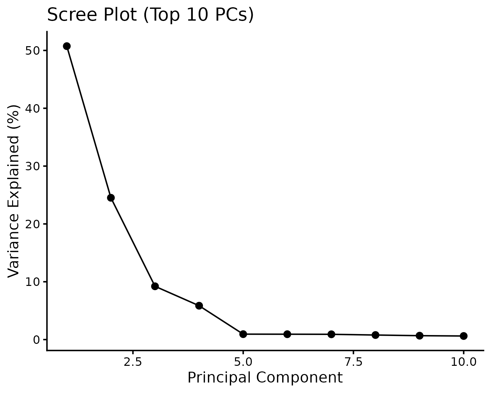

# Population Structure of an Indian COVID-19 Cohort  
### Joint PCA with 1000 Genomes Reference

---

## Context

Genomic studies remain disproportionately Eurocentric, limiting discovery in diverse populations such as India. This work forms part of a GWAS investigating genetic determinants of COVID-19 severity, with a specific focus on how **reference panel choice (global vs indigenous)** influences signal detection.

PCA is used here as a **structural validation layer**, not an exploratory endpoint.

---

## Result

The study cohort clusters tightly within the **South Asian (SAS)** ancestry space defined by the 1000 Genomes reference. ***(expected for indian dataset)***

- PC1 (~50%) separates African vs non-African ancestry  
- PC2 (~24%) resolves Eurasian structure  
- Study samples show **coherent alignment with SAS**, with moderate vertical spread  

This spread reflects **within-population heterogeneity**, consistent with known South Asian substructure. No discrete ancestry outliers are observed.

---

## Variance Structure

  

- PC1–PC2 capture ~75% of variance  
- PC1–PC4 capture ~90%  
- Higher PCs represent fine-scale structure  

These components are sufficient for GWAS covariate adjustment.

---

## Analytical Design

PCA is computed on a **joint dataset**:

**Indian COVID-19 cohort + 1000 Genomes reference**

This anchors the cohort within a global genetic framework and enables direct biological interpretation.

---

## Pipeline (minimal)

QC → Harmonization → SNP intersection → Merge → LD pruning → PCA     

Design choices prioritize **allelic consistency and genome-wide independence** over maximal variant retention.

---

## Role in GWAS

- Confirms ancestry alignment  
- Identifies outliers (none observed)  
- Provides PCs for population stratification control  

This step ensures that downstream association signals are not confounded by population structure.

---

## Study

Kaushik, Mohite et al., 2026  
*PLOS Neglected Tropical Diseases*  
https://doi.org/10.1371/journal.pntd.0014020  

---

## Reproducibility

Pipeline scripts are provided for methodological transparency.  
Minor variation across environments is expected.

---

## Author

Ramakant Mohite